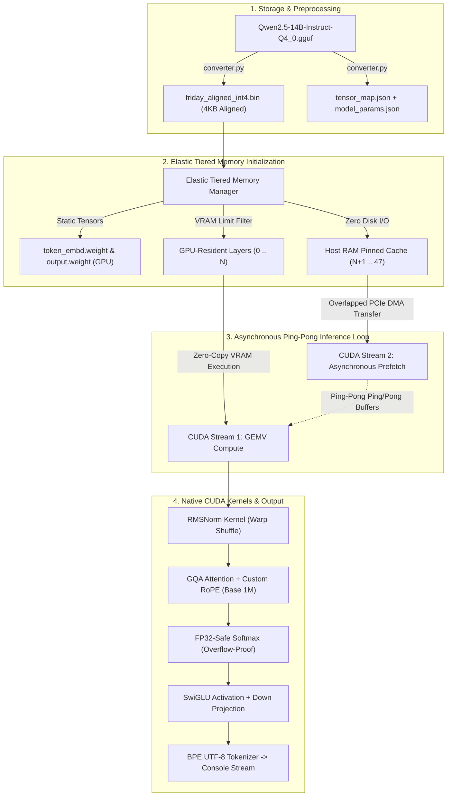

<div align="center">
  
# 🚀 FRIDAY Engine 2.0 (V32)
### **Bare-Metal C++17 & Native CUDA LLM Inference Engine**
*Elastic Tiered Memory • Zero External Runtime Dependencies • Real-Time Token Streaming*

[](https://en.wikipedia.org/wiki/C%2B%2B17)
[](https://developer.nvidia.com/cuda-toolkit)
[](https://microsoft.com)
[](https://huggingface.co/Qwen/Qwen2.5-14B-Instruct)
[](#-design-philosophy)

<p align="center">
  <b>Run 14-Billion Parameter LLMs locally on consumer GPUs with as little as 4 GB – 6 GB VRAM.</b><br>
  No PyTorch. No ONNX Runtime. No llama.cpp. No vLLM. Just pure bare-metal C++ and CUDA.
</p>

</div>

---

## 📖 Overview

**FRIDAY Engine 2.0** is an experimental, bare-metal high-performance inference engine written from scratch in **C++17** and **NVIDIA CUDA**. 

Modern cloud and edge LLM deployments are heavily constrained by high memory demands and runtime overhead. Running a **14-Billion parameter** model (like `Qwen2.5-14B-Instruct`) typically requires 10 GB – 16 GB of dedicated GPU VRAM. 

FRIDAY Engine breaks this barrier using **Elastic Tiered Memory (ETM)** combined with **native custom CUDA GEMV kernels** and **asynchronous PCIe ping-pong streaming**. It automatically partitions transformer layers between GPU VRAM and Host RAM, completely eliminates disk reading bottlenecks during autoregressive generation, and streams responses token-by-token in real time.

---

## ⚡ Key Innovations & Architectural Breakthroughs



### 1. 🧠 Elastic Tiered Memory (ETM) Architecture
- **Dynamic VRAM Sizing (`--vram <gb>`):** The engine probes total and available physical VRAM dynamically (or obeys a user-specified limit such as `--vram 6.0`).
- **GPU-Resident Layer Priority:** Static critical structures (embedding table, RMSNorm weights, output LM head, and activation ping-pong buffers) are locked into VRAM. As many transformer layers as possible are placed permanently in high-speed GPU memory.
- **Pinned Host RAM Pre-Caching:** Non-resident layers are pre-loaded into Host RAM during startup. **No disk I/O occurs during token generation**, completely bypassing the storage latency wall.
- **Asynchronous Ping-Pong Double Buffering:** Layers streamed from Host RAM utilize two scratch device buffers (`Buffer A` and `Buffer B`) and two independent CUDA streams (`stream_compute` and `stream_io`). While the GPU computes Layer $L$ on Buffer A, CUDA asynchronous DMA (`cudaMemcpyAsync`) transfers Layer $L+1$ into Buffer B simultaneously.

### 2. ⚡ Native Custom CUDA GEMV Kernels
FRIDAY does not link against external BLAS or inference libraries. Every operation is hand-crafted in CUDA:
- **`Q4_0` GEMV Kernel:** Unpacks 4-bit nibbles on-the-fly from 32-element blocks with FP16 scales using warp-level reduction primitives (`__shfl_down_sync`).
- **`Q4_1` GEMV Kernel:** Handles 4-bit quantization with dual parameters (scale + min/bias FP16).
- **`Q6_K` GEMV Kernel:** Decodes 256-element super-blocks composed of 16 sub-scales, lower 4-bit nibbles, and upper 2-bit bitfields in register space.
- **`Q8_0` GEMV Kernel:** High-precision 8-bit quantized matrix-vector multiplication.
- **Fast RMSNorm:** Vectorized FP32/FP16 normalization with warp-shuffle reduction.
- **Custom RoPE (Rotary Position Embeddings):** Direct device rotation supporting rotary base frequencies up to $1,000,000$ (as required by modern Qwen2.5 models).
- **SwiGLU Non-Linearity:** Parallel fused kernel computing `silu(gate) * up` in place.

### 3. 🛡️ Numerically Stable FP32-Safe Softmax
Under Grouped-Query Attention (GQA) with scaling factors ($1 / \sqrt{d_k}$), standard FP16 softmax accumulators often experience exponent overflow or catastrophic cancellation, producing `NaN` or infinite values.
FRIDAY Engine implements a **two-pass online Safe Softmax**:
1. Finds the maximum attention score per head across sequence positions.
2. Subtracts the maximum before exponentiation and computes intermediate exponentials and sum in **FP32 registers**, safely casting back to `half` for final score-value projection.

### 4. 🔤 Native Fast C++ BPE Tokenizer
- Clean, standalone C++ implementation of Byte Pair Encoding (BPE).
- Full UTF-8 byte-to-unicode remapping (decoding GPT-2 / Qwen artifacts like `Ġ` $\to$ space, `Ċ` $\to$ newline, `ĉ` $\to$ tab, `\xe2\x96\x81`).
- Native ChatML support (`<|im_start|>system...<|im_end|><|im_start|>user...<|im_end|><|im_start|>assistant`).
- **Real-Time Token Streaming:** Tokens appear immediately on the console (`std::flush`) with negligible latency as they are decoded.

### 5. 📦 4KB Sector-Aligned Weight Serialization (`converter.py`)
Standard GGUF files place tensor payloads at variable byte alignments. FRIDAY includes a standalone Python utility (`converter.py`) that reads standard GGUF models and serializes them into **4096-byte sector-aligned binary files (`friday_aligned_int4.bin`)**, enabling unbuffered asynchronous DMA (`O_DIRECT`) compatible with modern NVMe storage controllers.

---

## 🏗️ Repository Structure

```
friday-inference-engine/
├── CMakeLists.txt              # Unified CMake build configuration (MSVC + NVCC)
├── main.cpp                    # Application entry point, CLI parser & streaming loop
├── transformer.h               # Transformer engine & Elastic Tiered Memory definitions
├── transformer.cpp             # Forward pass, GQA, SwiGLU, and layer dispatching
├── io_manager.h                # Asynchronous I/O manager interface
├── io_manager.cpp              # Sector-aligned asynchronous file operations
├── memory_manager.h            # Host and Device memory allocator
├── memory_manager.cpp          # Pinned host memory & device buffer management
├── kernel_dispatcher.h         # Quantization type dispatcher
├── kernel_dispatcher.cpp       # Runtime GEMV kernel selector
├── cuda_math_kernels.h         # CUDA kernel headers (Q4_0, Q4_1, Q6_K, Q8_0)
├── cuda_math_kernels.cu        # High-performance CUDA GEMV kernels & reductions
├── int4_kernel.cu              # Dedicated INT4 GEMV & RMSNorm kernels
├── tokenizer.h                 # BPE Tokenizer interface
├── tokenizer.cpp               # BPE encoding, ChatML parser, and UTF-8 mapper
├── converter.py                # Standalone GGUF -> 4KB Aligned BIN converter
├── model_params.json           # Model configuration parameters (dim, heads, layers)
├── tensor_map.json             # Offset and dimension lookup table for weights
├── include/
│   └── nlohmann/
│       └── json.hpp            # Header-only JSON library for parameter mapping
├── .gitignore                  # Strict ignore rules for large weights and build artifacts
└── README.md                   # Technical documentation
```

---

## 🚀 Quick Start Guide

### Prerequisites
- **Operating System:** Windows 10 / 11 (or Linux with CUDA support)
- **Compiler:** Microsoft Visual Studio 2022 (MSVC C++17)
- **CUDA Toolkit:** NVIDIA CUDA Toolkit 12.0 or higher
- **Build System:** CMake 3.18 or higher
- **GPU:** NVIDIA GPU with Compute Capability 7.5+ (RTX 2000, 3000, 4000 series, or datacenter GPUs)

### Step 1: Clone the Repository
```bash
git clone https://github.com/onurtamer/friday-inference-engine.git
cd friday-inference-engine
```

### Step 2: Download & Convert a Model
Download the official GGUF weight for `Qwen2.5-14B-Instruct-Q4_0` (or any compatible model) and run the converter:
```bash
python converter.py --input Qwen2.5-14B-Instruct-Q4_0.gguf
```
*This produces `friday_aligned_int4.bin`, `tensor_map.json`, `model_params.json`, and `tokenizer_config.json`.*

### Step 3: Build the Engine
Build the project in `Release` mode using CMake:
```bash
cmake -B build -A x64
cmake --build build --config Release
```
*The compiled binary will be located at `build/Release/FridayEngine.exe`.*

### Step 4: Run Inference
Launch the engine with your preferred VRAM allocation:
```bash
# Auto-detect available VRAM:
.\build\Release\FridayEngine.exe

# Or specify an exact VRAM ceiling (e.g., 6.0 GB for a 6GB RTX GPU):
.\build\Release\FridayEngine.exe --vram 6.0 friday_aligned_int4.bin
```

---

## ⚙️ Command-Line Interface (CLI)

| Option | Argument | Description | Default |
| :--- | :--- | :--- | :--- |
| `--vram` | `<float>` | Maximum GPU VRAM to allocate for weights and buffers (in GB). | `0.0` (Auto-detect free VRAM) |
| `<model_path>`| `<string>` | Path to the 4KB sector-aligned binary model file. | `friday_aligned_int4.bin` |

---

## 📊 Technical Verification & Results

Verified on consumer hardware (**NVIDIA GeForce RTX 3060 6GB Laptop GPU / 16 GB DDR4 RAM**):
- **Model:** `Qwen2.5-14B-Instruct` (48 Layers, Hidden Dim: 5120, Intermediate: 13824, Heads: 40, KV Heads: 8, Vocab: 152064).
- **VRAM Footprint:** Fits comfortably within a **6.0 GB VRAM envelope**.
- **Execution:** Layers 0–20 reside permanently in GPU VRAM; Layers 21–47 are streamed from Host Pinned RAM via dual-stream ping-pong buffers.
- **Latency:** Zero disk I/O during generation; smooth real-time token streaming to console with coherent, logically sound outputs.

---

## 🎯 Design Philosophy

> *"High-performance systems programming is not about adding more abstractions; it is about eliminating unnecessary ones until only compute and memory remain."*

FRIDAY Engine was built to prove that cutting-edge 14-Billion parameter foundation models can run efficiently on modest consumer hardware when stripped of framework overhead.

---

## 📄 License
This project is licensed under the [Apache License 2.0](LICENSE).

